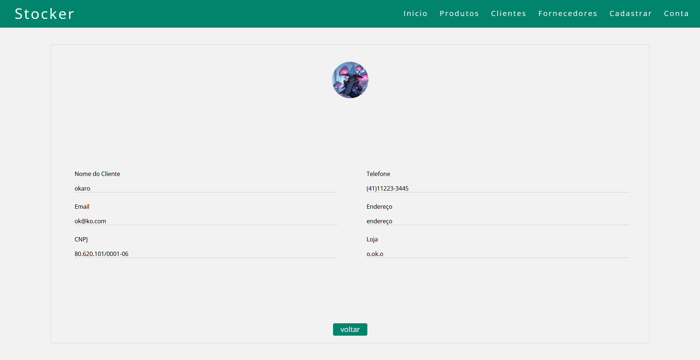

<p align="center">
  
</p>

<h1 align="center">Stocker - Projeto de gerenciamento simples de estoque</h1>

## Descrição
O **Stocker** é um sistema de gerenciamento de estoque simples desenvolvido para fins de aprendizado, este conta com a visualização e cadastro de fornecedores e pedidos. No momento, apenas a parte administrativa foi implementada.

## Funcionalidades
- **Cadastro de Clientes**: Registre e gerencie informações de clientes. <p></p>
  

- **Cadastro de Produtos**: Controle seu estoque cadastrando produtos.
  
- **Cadastro de Fornecedores**: Mantenha informações de fornecedores organizadas.
  
- **Gerenciamento de Pedidos**: Registre pedidos e acompanhe seu status.
- **Visualização de Produtos e Clientes**: Consulte de forma rápida os produtos e clientes cadastrados.
  
## Tecnologias Utilizadas
- **Frontend**: HTML, CSS e JavaScript (Vanilla)
- **Backend**: Java com Spring Boot
- **Banco de Dados**: MySQL em Docker

## Como Rodar o Projeto
1. Clone o repositório:
   ```bash
   git clone https://github.com/seu-usuario/stocker.git
   ```
2. Configure o banco de dados MySQL em Docker:
   ```bash
   cd ./Back-end/
   docker compose up
   ```
4. Configure o backend:
   ```bash
   cd backend
   mvn install
   mvn spring-boot:run
   ```
5. Configure o frontend:
   ```bash
   cd frontend
   abra o arquivo products.html no navegador
   ```

## Contribuição
Sinta-se à vontade para contribuir! Para isso, siga os seguintes passos:
1. Faça um Fork do projeto.
2. Crie uma branch para sua feature (`git checkout -b feature-nova`).
3. Faça commit das mudanças (`git commit -m 'Minha nova feature'`).
4. Faça um push para a branch (`git push origin feature-nova`).
5. Abra um Pull Request.
   
---
**Autor:** Gustavo Goetten Aguilar  
**Contato:** [gustavogoetten@alunos.utfpr.edu.br](mailto:gustavogoetten@alunos.utfpr.edu.br)


Use Control + Shift + m to toggle the tab key moving focus. Alternatively, use esc then tab to move to the next interactive element on the page.
Attach files by dragging & dropping, selecting or pasting them.
Editing Stocker/README.md at main · Gustavo-Agui1ar/Stocker
